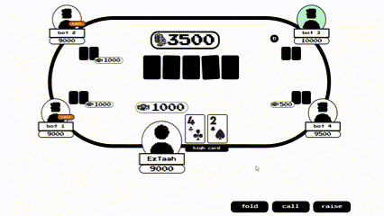
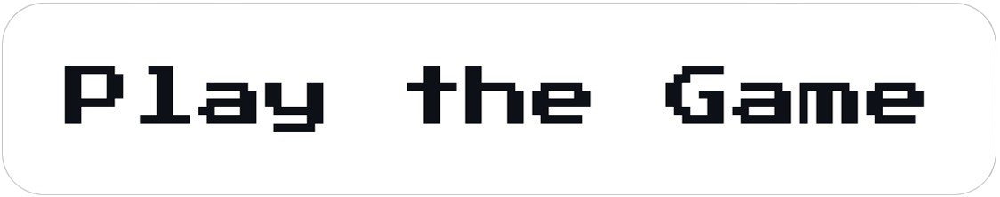

<div align="center">

# onlinepoker

*Developed in August 2022*

<br>

"A multiplayer poker game where you can compete against both friends and bots." 

<br>

This game is built using JavaScript for game logic, Node.js for server-side operations, and Socket.io for real-time client-server communication.

<br>



<a href="https://onlinepoker.onrender.com/">  </a>

<br>
<br>

</div>

---

# Building and Development

The server for this project is hosted on [render](https://dashboard.render.com/). For local development, it's advisable to set up a server locally. Below are the detailed instructions for setting up a local server.

<br>


## Running the Local Server

1. **Download and install [Nodejs](https://nodejs.org/en).** 

<br>

2. **Open a PowerShell terminal and navigate to the project directory.**

<br>

3. **Install all required Node.js dependencies by running:**
    ```bash
    npm install
    ```
    If the `package.json` file is missing, follow the instructions in [Nodejs Setup](./docs/documentation/nodejs-setup.md) to initialize your Node.js environment.

<br>

4. **Start the development server:**
    ```bash
    npm run dev
    ```

<br>

5. **Open a web browser and navigate to:**
    ```bash
    localhost:4000
    ```

<br>
<br>

-> To publish the server on Render, follow the guide: [Publish on Render](./docs/documentation/publish-on-render.md).